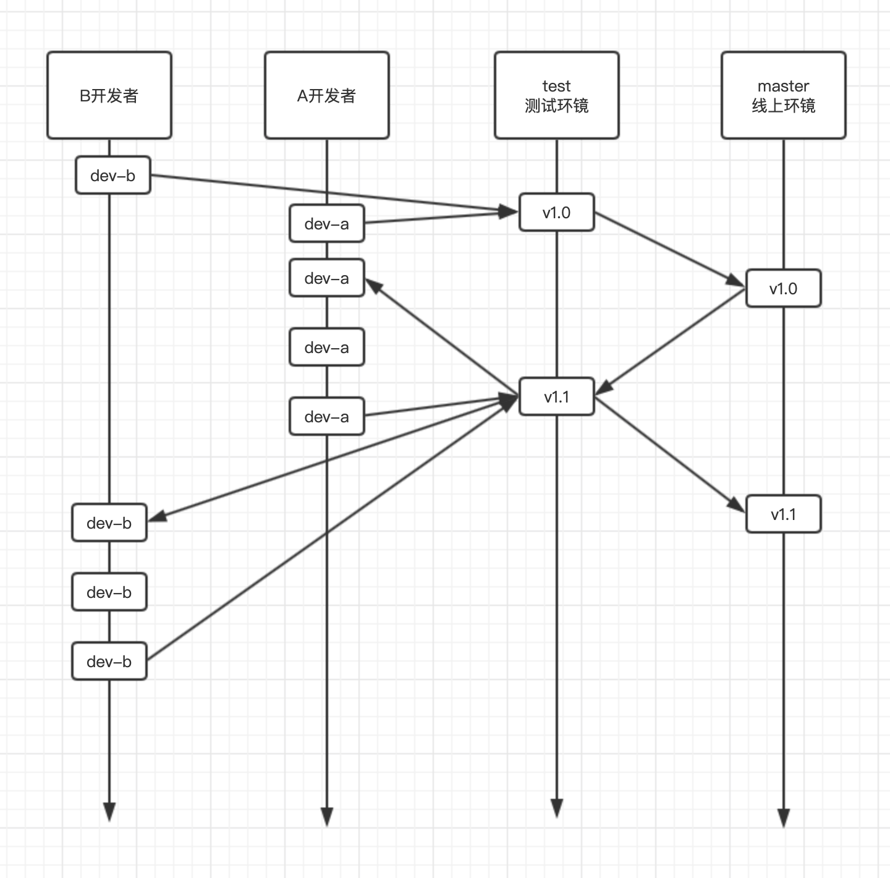
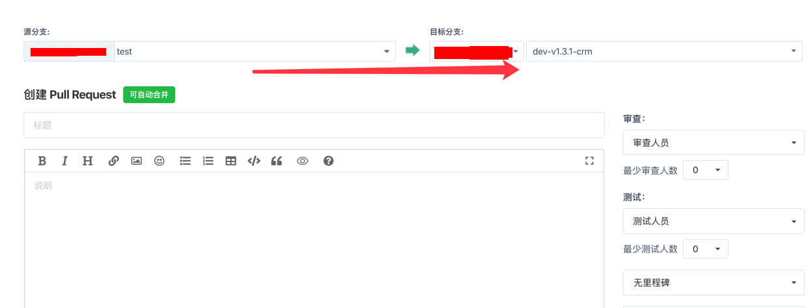
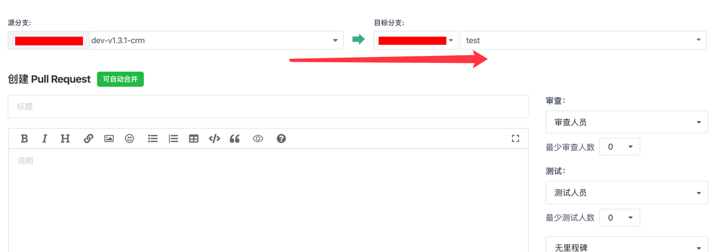

# git-blog

读心印的git笔记

### 常用命令

拉取一个仓库
```shell
git clone git@gitee.com:flash127/docker.git
```

当前的状态
```shell
git status
```

下载远程代码并合并
```shell
git add . && git commit -m '本次修改内容'
```

推送到远程仓库`test`分支
```shell
git push origin test
```

拉取远程分支
```shell
git pull
```

查看近5次提交
```shell
git log -5
```

回滚到某次提交
```shell
git reset 4205453926xxxx
```

创建分支
```shell
git branch 
```

切换分支
```shell
git checkout test
```

将test分支合并到当前分支
```shell
git merge test
```

查看标签
```shell
git tag
```

添加标签
```shell
git tag v1.0.0
```

推送标签到远程仓库
```shell
git push --tag
```

### 分支管理

这是我们小团队的分支管理方式,适用于前后端

- 每个开发者负责一个独立模块       
- 每个开发者在test分支上新建一个自己的开发分支        
- 当某个功能模块完全开发好之后 提交PR到test分支 并由管理员合并后 通知测试人员进行测试    
- 当A开发者开发完A功能模块时, B开发者分支中没有A开发者代码,请自行去test分支拉取最新代码合并到自己的分支中     
- 如果遇到冲突时,找相应的开发人员,协商后再解决冲突问题




在提交代码前 请使用 `composer fix` 修复代码风格

详细文档见 ` fabpot/php-cs-fixer ` composer扩展包

[https://packagist.org/packages/friendsofphp/php-cs-fixer](https://packagist.org/packages/friendsofphp/php-cs-fixer)


### 把test分支中代码合并到自己分支上



当显示可自动合并时,创建,并确定合并      
合并后 在自己的开发项目中 `git pull` 即可


- 如果无法自动合并

1.在自已电脑切换到test分支 `git checkout test`    
2.如果本地没这个分支 则 `git checkout -b test origin/test`    
3.在test分支上 `git pull`   
4.切回自己的开发分支 `git checkout xxx`  

> 以上3步也可以使用 ` git fetch origin test:test` 1步操作

5.将test分支合并到自己的分支上 `git merge test` **注意合并前,请先提交一份,以免丢失**   
6.检查上面的冲突文件,并修复冲突即可


### 提交到test分支上 

与gitbug开源项目类似,只是我们现在都在同一个仓库中



当显示可自动合并时,创建 **这时不要自己合并了,找管理员审核后完成合并**


## 参与贡献

1. fork 当前库到你的名下
2. 在你的本地修改完成审阅过后提交到你的仓库
3. 提交 PR 并描述你的修改，等待合并

## License

[MIT license](https://opensource.org/licenses/MIT)