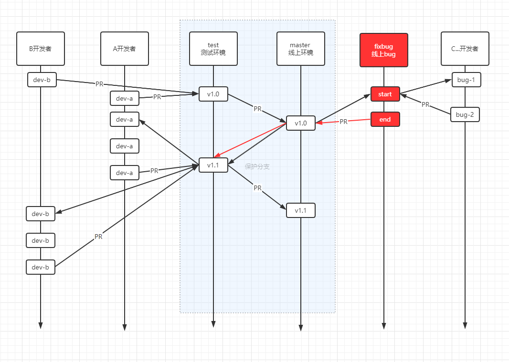
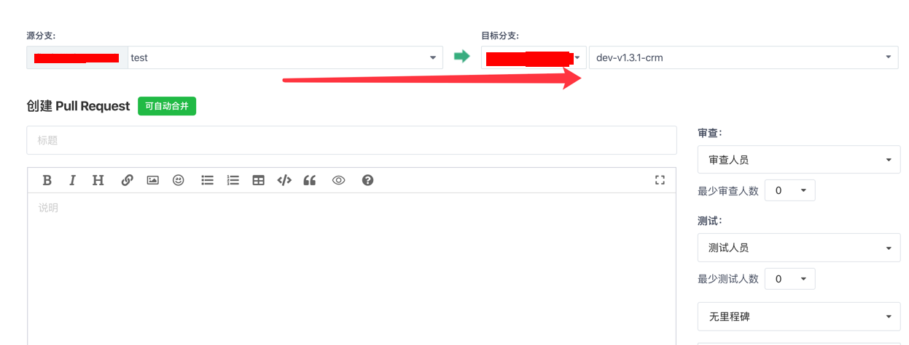
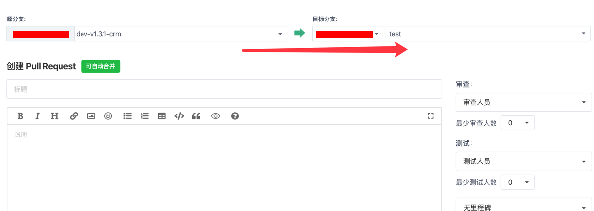

### 分支管理

这是我们小团队的分支管理方式,适用于前后端

- 每个开发者负责一个独立模块
- 每个开发者在test分支上新建一个自己的开发分支
- 当某个功能模块完全开发好之后 提交PR到test分支 并由管理员合并后 通知测试人员进行测试
- 当A开发者开发完A功能模块时, B开发者分支中没有A开发者代码,请自行去test分支拉取最新代码合并到自己的分支中
- 如果遇到冲突时,找相应的开发人员,协商后再解决冲突问题

在提交代码前 请使用 `composer fix` 修复代码风格

详细文档见 ` fabpot/php-cs-fixer ` composer扩展包

[https://packagist.org/packages/friendsofphp/php-cs-fixer](https://packagist.org/packages/friendsofphp/php-cs-fixer)

### 把test分支中代码合并到自己分支上

当显示可自动合并时,创建,并确定合并      
合并后 在自己的开发项目中 `git pull` 即可

- 如果无法自动合并

1.在自已电脑切换到test分支 `git checkout test`    
2.如果本地没这个分支 则 `git checkout -b test origin/test`    
3.在test分支上 `git pull`   
4.切回自己的开发分支 `git checkout xxx`

> 以上3步也可以使用 ` git fetch origin test:test` 1步操作

5.将test分支合并到自己的分支上 `git merge test` **注意合并前,请先提交一份,以免丢失**   
6.检查上面的冲突文件,并修复冲突即可

### 提交到test分支上

与gitbug开源项目类似,只是我们现在都在同一个仓库中

当显示可自动合并时,创建 **这时不要自己合并了,找管理员审核后完成合并**
